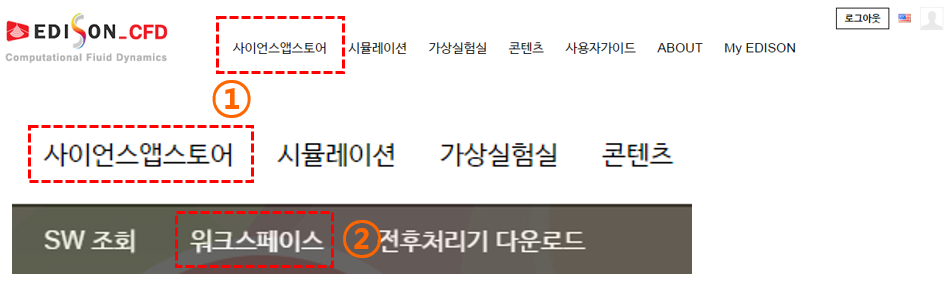
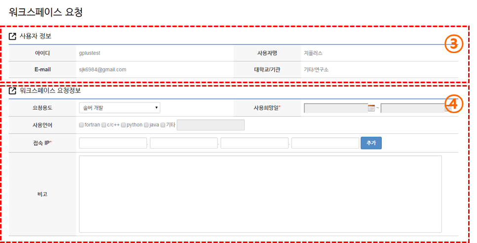
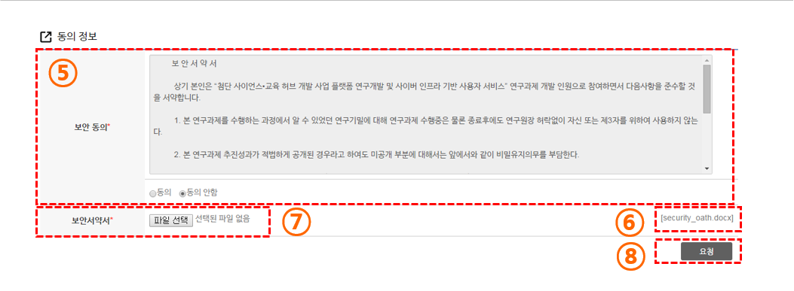
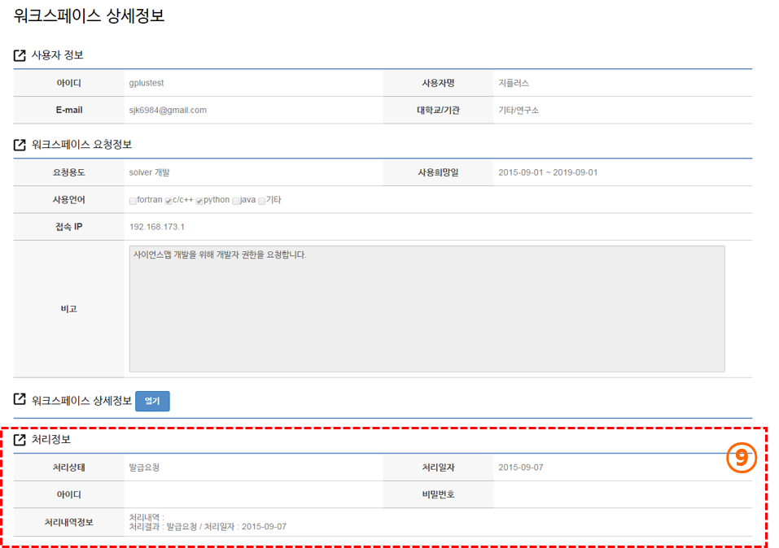
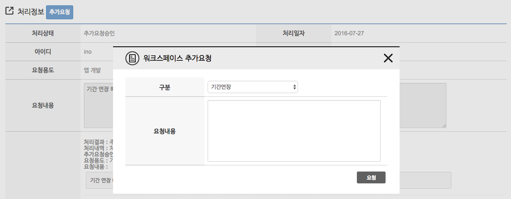

# EDISON 개발자 계정 발급 받기

 EDISON 웹 포털에 시뮬레이션 SW를 등록하기 위해서는 개발자 권한을 얻어야 합니다. 개발자 권한을 받은 아이디는 시뮬레이션 SW를 등록 할 수 있으며, EDISON 개발자 개발 서버인 Bulb에 접근할 수 있는 계정을 발급 받을 수 있습니다. 시뮬레이션 SW 등록 시에는 시뮬레이션 SW 관련 정보를 입력해야 하며, 이는 웹 포털에서 할 수 있습니다.
 
### 개발자 계정 신청

(1) 분야별 사이트의 사이언스앱스토어 메뉴를 선택합니다.

(2) 하위메뉴의 워크스페이스 메뉴를 선택합니다. 

 (3) 현재 사용자의 기본 정보를 확인합니다.
 
 (4) 양식에 맞춰 요청 정보를 입력합니다. 여기에 입력한 IP에서만 Bulb 서버에 접속이 가능합니다. 본인이 접속하고자 하는 IP를 정확하게 입력해주셔야 하며, 추가 메뉴를 이용하면 여러 IP를 입력할 수 있습니다.

  

(5) 보안 서약서 약관을 확인 후 사용자 동의를 체크 합니다.

(6) 보안 서약서 서명 파일을 다운로드 받습니다. 양식의 내용을 작성하고, 출력 후 자필 서명이 들어간 스캔 파일을 업로드 해주셔야 합니다.

(7) 작성한 보안서약서 파일을 업로드 합니다.

(8) 모든 작성이 완료된 이후 개발자 권한을 요청합니다.

(9) 개발자 권한 요청 정보를 확인합니다. 개발자 권한은 관리자의 승인 후 획득 할 수 있습니다.

(10) 승인이 완료가 되면, 공란이였던 아이디 비밀번호란에 Bulb 접속이 가능한 아이디와 초기 비밀번호 정보를 확인할 수 있습니다. 초기 비밀번호의 경우 장기간 미 접속으로 인한 비밀번호 만료 또는 비밀번호 분실시 사이트 관리자에게 문의하면 해당 비밀번호로 초기화 됩니다.

### 개발자 계정 관련 문의 요청 

Bulb 접속 아이피 추가 신청, 비밀번호 분실, 장기간 미접속으로 인한 비밀번호 만료 등의 이유로 관리자에게 문의가 필요한 경우 아래와 같이 워크스페이스 페이지에서 추가 요청 신청을 할 수 있습니다.

- 개발자 권한을 신청한 사이트 접속 > 사이언스 앱스토어 > 워크스페이스 클릭

처리정보 텝에서 제목 옆에 있는 추가요청 선택, 이후 요청사항에 맞는 구분을 선택하시고, 요청내용을 작성하여 요청하시면 됩니다.