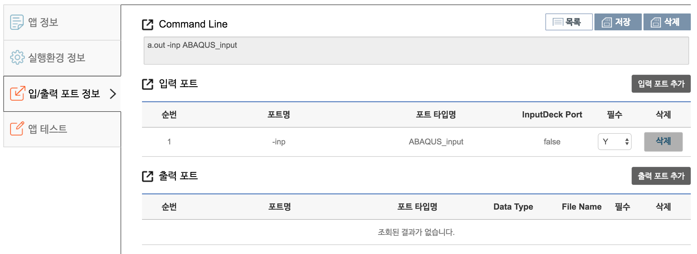

# 입력 파일이 1개인 경우

#### Case 1. 입력 파일이 1개인 경우  

본 예제는 실행 파일이 **a.out**이며, 커맨드 옵션(포트 명)이 "-inp"인 입력 파일을 읽어와 path 정보를 출력하는 코드이다.

 - 리눅스 상에서 실행 커맨드 예 ::  
   - **./a.out -inp /home/user1/data/sample1.dat** 

예제에 맞게 작성된 입력 포트 정보는 아래 그림과 같다.  

