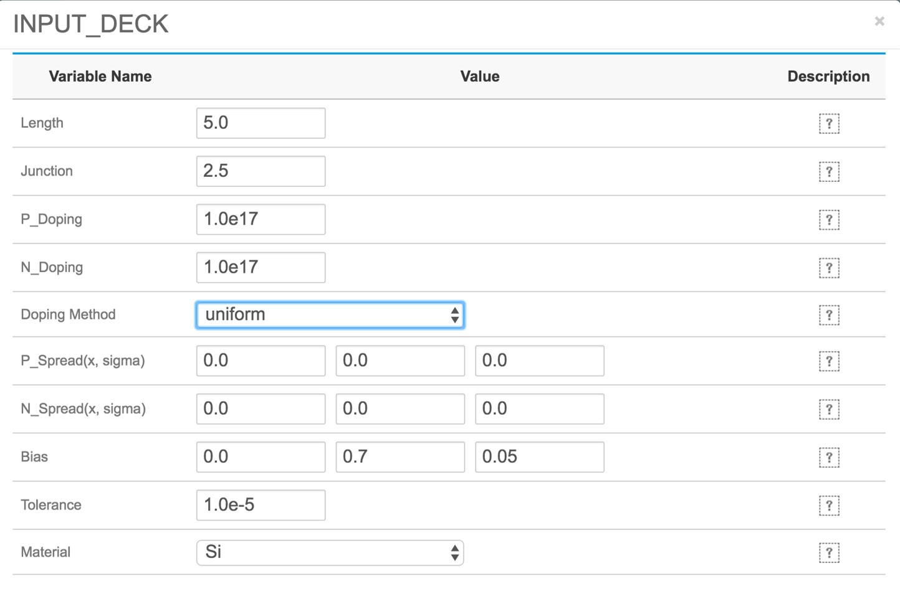
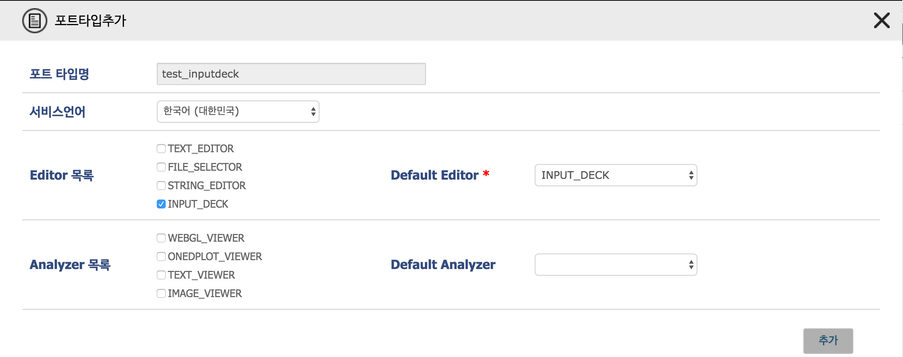

# Inputdeck을 입력 파일로 사용하는 경우 

#### Case 3. Inputdeck을 입력 파일로 사용하는 경우 

EDISON 플랫폼에서는 Inputdeck 이라는 기능을 제공하여, 시뮬레이션 수행에 필요한 변수 값, 문자열, 벡터등의 데이터를 웹에서 바로 입력할 수 있는 기능을 제공하고 있다. 


Inputdeck를 자신의 시뮬레이션 SW에 활용하고 싶다면, Inputdeck에서 생성되는 입력 파일을 읽을 수 있도록 프로그램을 작성해야 한다.
Inputdeck 작성 시 입력 파일을 생성하는 규칙을 정할 수 있으며, 이 규칙에 따라 생성된 입력 파일을 읽어 올 수 있으면 된다.
프로그램 작성 시 유의 사항은 다음과 같다.
- Inputdeck 생성 규칙에 맞게 변수 값을 읽어와야 함
- Inputdeck 데이터의 생성 순서에 상관 없이도 동작해야 함
- 원하는 변수 값들이 정상적으로 입력되지 않았다면 에러 메시지를 발생 시켜야 함 

**사이언스 앱스토어 > 앱 관리 > 앱 생성 > 입/출력 포트 정보 ** 에서 신규 포트 생성 시 Editor 목록에서 **INPUT_DECK**을 선택하고 **추가** 버튼을 누르면 Inputdeck을 Editor로 사용하는 인풋 포트를 생성할 수 있다


이후 Inputdeck 정의 화면을 통해 변수와 벡터가 생성되는 규칙을 설정 할 수 있다. 

 

- ```value delimiter``` : 변수 이름과 변수 값을 구분해 주는 기호를 설정하는 부분이다. ```EQUAL```과 ```SPACE```를 선택할 수 있다.
- ```Line delimiter ``` : 하나의 변수가 종료 됨을 알려주는 문자를 선택할 수 있다. 기본적으로 변수간에 자동 줄바꿈이 들어가 있으며, ```SEMICOLON```, ```COLON```, ```NULL``` 중에 하나를 선택할 수 있다.
- ```Comment Char``` : 입력 파일에 주석 처리를 하고자 하는 경우 주석 문의 시작 문자를 설정
- ```Vector bracket``` : 벡터 변수 사용시 괄호의 종류를 선택할 수 있다. ```SQUARE```, ```ROUND```, ```SQUARE_SPACE```, ```ROUND_SPACE``` 선택 가능하며 ```_SPACE```가 붙은 경우에는 괄호와 벡터 원소 사이에 space가 들어가 있는 상태로 생성된다.
- ```Vector Delimiter``` : 벡터 원소간 구분해 주는 기호를 설정 ```COMMA```와 ```SPACE``` 중에 하나를 설정할 수 있다. 


