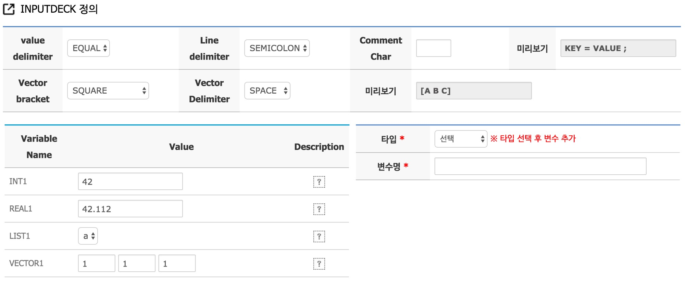

# Code example


### Inputdeck case study 1

다음과 같이 정수형 변수 1개, 실수형 변수 1개, 리스트형 변수 1개, 3차원 벡터 1개를 받는 Inputdeck를 생성하였다. 


Inputdeck에서 필요한 정보들만 담기 위해 Inputdeck 설정 값을 다음과 같이 정하였다. 

| INPUTDECK key | value |
| -- | -- |
| value delimiter | SPACE |
| line delimiter | NULL |
| Vector vracket | SQUARE_SPACE |
| Vector delimiter | SPACE |

이렇게 설정되어 생성된 입력 파일은 다음과 같다.

```
INT1 42
REAL1 42.112
LIST1 a
VECTOR1 [ 1 0 0 ]
```


####Code example
```python
#!/usr/local/bin/python

import sys
import getopt

try:
      opts, args = getopt.getopt(sys.argv[1:],"i:" ,["inp="])
except getopt.GetoptError as err:
      print str(err)
      sys.exit(1)

for opt,arg in opts:
      if  opt in ("-i", "--inp"):
            f_inputdeck = open(arg, "r")

print "input file = " + f_inputdeck.name
inputdeck_lines = f_inputdeck.readlines()

for line in inputdeck_lines:
      opt  = line.split()[0]
      if opt in "INT1":
            int1 = int(line.split()[1])
            print "init1 :" + str(int1)
      elif opt in "REAL1":
            real1 = float(line.split()[1])
            print "real1 :" + str(real1)
      elif opt in "LIST1":
            list1 = line.split()[1]
            print "list1 :" + list1
      elif opt in "VECTOR1":
            vector1 = map(int, line.split("[")[1].split(']')[0].split())
            print "vector1 :" + str(vector1)
      else:
            print "error"
            sys.exit(1)


f_inputdeck.close()


```
[입력 파일이 1개인 경우의 Python 예제 코드](input/Python_example.md)에서 Inputdeck 파일을 읽는 부분을 추가한 예제이다. 


#####주요 코드 설명

```Python
...
for line in inputdeck_lines:
      opt  = line.split()[0]
      if opt in "INT1":
            int1 = int(line.split()[1])
            print "init1 :" + str(int1)
      elif opt in "REAL1":
            real1 = float(line.split()[1])
            print "real1 :" + str(real1)
      elif opt in "LIST1":
            list1 = line.split()[1]
            print "list1 :" + list1
      elif opt in "VECTOR1":
            vector1 = map(int, line.split("[")[1].split(']')[0].split())
            print "vector1 :" + str(vector1)
      else:
            print "Error Invalid value name :: " + opt
            sys.exit(1)
...
```

-  ```for``` 문을 이용해 입력 파일의 모든 라인을 한줄씩 읽어 ```line```에 저장한다. 
- 문자열을 나누기 위해 [split()](https://wikidocs.net/13) 함수를 사용한다. 예제에서 처럼 괄호 안에 아무런 값도 넣어 주지 않으면 공백을 기준으로 문자열을 나누어 준다.
  - ```line = "INT1 42"``` 인 경우 이 문자열을 나눈 결과 ```line.split()```는 ```['INT1', '42']``` 가 되고, 각각의 요소들을 지정하기 위해 뒤에 ```[숫자]``` 추가해 요소를 지정한다. ```line.split()[0] ='INT1'``` 이며, ```line.split()[1] = 42```이다.
- 공백으로 나눈 값의 첫 번째 요소를 ```opt```에 저장해 해석에 필요한 변수 이름과 비교에 각각 저장한다.
- 입력 파일에 저장된 값들은 문자열 이므로 숫자를 저장해야 하는 경우 이에 맞게 형 변환을 해주어야 한다. 정수 형으로 변환하는 경우 ```int()```, 실수로 저장하는 경우 ```float()```을 이용하면 된다.

- ```vector1 = map(int, line.split("[")[1].split(']')[0].split())``` 을 정리하면
  - 초기 ```line```은 ```VECTOR1 [ 1 3 0 ]```이며, 이를 ```[```로 나누면, 나눠서 저장된 배열의 2번째 값 ```line.split("[")[1]```은 ```1 3 0 ]```이 된다. 
  - 이를 다시 ```]```나눈 값의 첫 번째 값 ```.split("]")[0]```은 ```1 3 0``` 이 된다.
  - 이를 다시 공백으로 나누어 배열에 저장하고 [map(int, [배열])](http://stackoverflow.com/questions/7368789/convert-all-strings-in-a-list-to-int) 함수를 통해 문자 값인 각각의 원소를 정수 형으로 변환 시킨다.

[예제 다운 받기](../code/python/case3.py)


### Inputdeck case study 2

다음과 같이 정수형 변수 1개, 실수형 변수 1개, 리스트형 변수 1개, 3차원 벡터 1개를 받는 Inputdeck를 생성하였다. 



Inputdeck에서 필요한 정보들만 담기 위해 Inputdeck 설정 값을 다음과 같이 정하였다. 

| INPUTDECK key | value |
| -- | -- |
| value delimiter | EQUAL |
| line delimiter | SEMICOLON |
| Vector vracket | SQUARE_SPACE |
| Vector delimiter | SPACE |

이렇게 설정되어 생성된 인풋 파일은 다음과 같다.

```
INT1 = 42 ;
REAL1 = 42.112 ;
LIST = a ;
VECTOR1 = [ 1 0 0 ] ;
```

####Code example
다음과 같이 생성된 입력 파일을 읽어와 같은 이름의 변수를 생성해 저장하는 코드이다. case 1의 코드와 크게 다르지 않으며, 벡터가 아닌 변수에 대해서는 ```split('=')``` 과 ```split(';')```을 이용해 변수 값을 저장한다. 

```python
#!/usr/local/bin/python

import sys
import getopt

try:
      opts, args = getopt.getopt(sys.argv[1:],"i:" ,["inp="])
except getopt.GetoptError as err:
      print str(err)
      sys.exit(1)

for opt,arg in opts:
      if  opt in ("-i", "--inp"):
            f_inputdeck = open(arg, "r")

print "input file = " + f_inputdeck.name
inputdeck_lines = f_inputdeck.readlines()

for line in inputdeck_lines:
      opt  = line.split()[0]
      if opt in "INT1":
            int1 = int(line.split('=')[1].split(';')[0])
            print "init1 : " + str(int1)
      elif opt in "REAL1":
            real1 = float(line.split('=')[1].split(';')[0])
            print "real1 : " + str(real1)
      elif opt in "LIST1":
            list1 = line.split('=')[1].split(';')[0]
            print "list1 : " + list1
      elif opt in "VECTOR1":
            vector1 = map(int,line.split("[")[1].split(']')[0].split())
            print "vector1 :" + str(vector1)
      else:
            print "error"
            sys.exit(1)
print vector1[0] + vector1[1]
print int1 + int1

f_inputdeck.close()
     
```

#####주요 코드 설명

```Python
int1 = int(line.split('=')[1].split(';')[0])
```
- ```line = 'INT1 = 42 ;'``` 이며 이를 ```=```로 나눈 ```line.split('=')[1]``` 값의 두 번째 값은 ```'42 ;'``` 가 된다. 이를 다시 ```;```로 나눈 첫번째 값은  ```'42'```인 문자열이 되며, 이를 ```int()``` 를 통해 정수로 형 변환을 시킨다.

