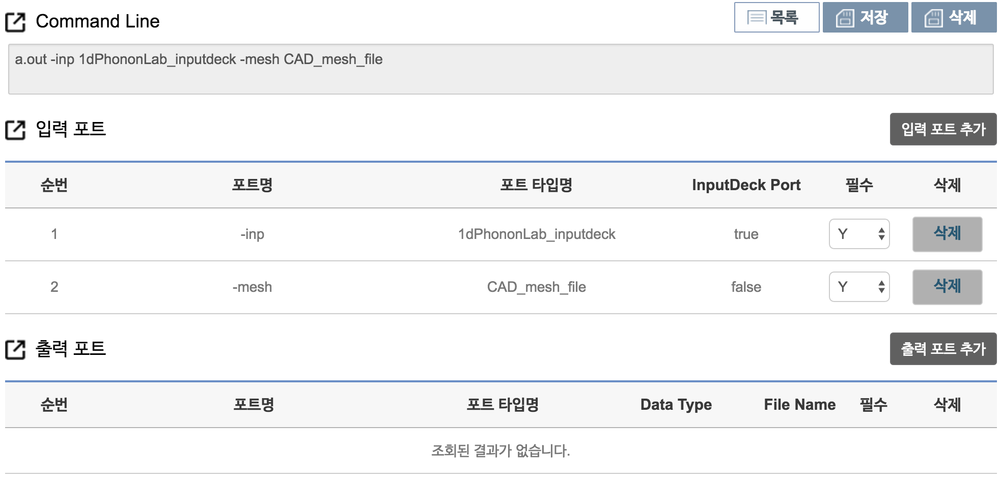
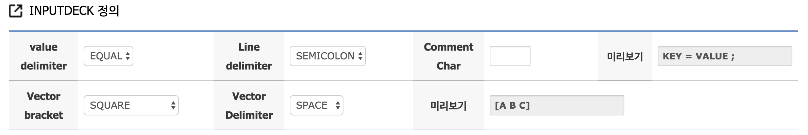

# 입력 프로그래밍

### 입력 프로그래밍

EDISON에서 시뮬레이션 SW 실행 시 1개 이상의 파일을 입력 받을 수 있고, 이를 구분하기 위해 각각 다른 커맨드 옵션(포트 명)을 통해 입력 파일을 받을 수 있도록 프로그래밍 되어야 한다. 


#### Case 2. 입력 파일이 2개인 경우  

본 예제는 실행 파일이 **a.out**이며, 커맨드 옵션(포트 명)이 "-inp"인 입력 파일과, "-mesh"인 입력 파일을 읽어와 path 정보를 출력하는 코드이다.

 - 리눅스 상에서 실행 커맨드 예 ::  
   - **./a.out -inp /home/user1/data/sample.inp -mesh /home/user1/data/sample.mesh** 


예제에 맞게 작성된 입력 포트 정보는 아래 그림과 같다.  





##### FORTRAN Code example

```fortran
      program sample

      CHARACTER(len=16) :: cmd_option_name
      CHARACTER(len=512) :: inputdeck, inputmesh
      INTEGER :: num_of_args, i
      LOGICAL :: args_error_flag = .false.

      num_of_args = iargc()

      do i=1, num_of_args, 2
            call getarg(i,cmd_option_name)

            if( cmd_option_name .eq. "-inp") then
                  call getarg(i+1,inputdeck)
            else if ( cmd_option_name .eq. "-mesh") then
                  call getarg(i+1,inputmesh)
            else
                  args_error_flag = .true.
                  WRITE (*,*) "ERROR: INVALID COMAND OPTION: " ,
     +            cmd_option_name
            endif
      enddo

      if ( args_error_flag .eqv. .true. ) then
            WRITE(*,*) "CHECK YOUR COMAND OPTION"
            stop
      endif

      inputdeck=trim(inputdeck)
      inputmesh=trim(inputmesh)

      write (*,*) "Input file path : ", inputdeck
      write (*,*) "Input file path : ", inputmesh


      end program

```
######주요 변수 설명 
 - ```cmd_option_name``` : 커맨드 옵션(포트 명)을 저장하는 크기가 16인 character형 배열로 선언
 - ```inputdeck``` : 입력 파일의 path를 저장하는 배열로 크기는 512인 characcter형 배열을 선언
 - ```num_of_args``` : 실행 시 같이 입력된 argument의 개수를 저장하는 변수 
 - ```args_error_flag = .false.``` : 커맨드 옵션(포트 명)이 잘못 입력된 경우, 이 변수의 값을 ```.true.```로 변경


######주요 코드 설명

```fortran
      ...
      num_of_args = iargc()
      ...
```
 - [iargc()](https://gcc.gnu.org/onlinedocs/gfortran/IARGC.html) 함수를 이용하여 입력된 argument의 개수를 ```num_of_args``` 변수에 저장 

```fortran
      ...
[1]   do i=1, num_of_args, 2   
[2]         call getarg(i,cmd_option_name)

[3]         if( cmd_option_name .eq. "-inp") then
                  call getarg(i+1,inputdeck)
[4]         else if ( cmd_option_name .eq. "-mesh") then
                  call getarg(i+1,inputmesh)
[5]         else
                  args_error_flag = .true.
                  write (*,*) "ERROR: INVALID COMAND OPTION: " ,
     +            cmd_option_name
            endif
      enddo
      ...
```
1. do loop를 이용해 num_of_args 개수 까지 i 값을 2씩 증가하면서 loop 문 수행
  - 예제에서 [iargc()](https://gcc.gnu.org/onlinedocs/gfortran/IARGC.html) 함수로 받은 값이 4 이므로 loop문이 두번 수행 됨 
2. [getarg()](https://gcc.gnu.org/onlinedocs/gfortran/GETARG.html#GETARG) 함수를 이용해 i번째 arument 값을 ```cmd_option_name``` 변수에 저장
3. 저장한 ```cmd_option_name```  값이 **-inp**와 같은지 확인하여 같으면, i+1번째 arument 값을 읽어서 ```inputdeck``` 배열에 저장. 
4. 저장한 ```cmd_option_name```  값이 **-mesh**와 같은지 확인하여 같으면, i+1번째 arument 값을 읽어서 ```inputmesh``` 배열에 저장
5. ```cmd_option_name``` 값이 **-inp**와 **-mesh** 같지 않으면, ```args_error_flag``` 를 ```.false.```로 변경하고 잘못 입력한 커맨드 옵션을 출력


#### Case 3. Inputdeck을 입력 파일로 사용하는 경우  

EDISON 플랫폼에서는 Inputdeck 이라는 기능을 제공하여, 시뮬레이션 수행에 필요한 변수 값, 문자열, 벡터등의 데이터를 웹에서 바로 입력할 수 있는 기능을 제공하고 있다. 


Inputdeck를 자신의 시뮬레이션 SW에 활용하고 싶다면, Inputdeck에서 생성되는 입력 파일을 읽을 수 있도록 프로그램을 작성해야 한다.
Inputdeck 작성 시 입력 파일을 생성하는 규칙을 정할 수 있으며, 이 규칙에 따라 생성된 입력 파일을 읽어 올 수 있으면 된다.
프로그램 작성 시 유의 사항은 다음과 같다.
- Inputdeck 생성 규칙에 맞게 변수 값을 읽어와야 함
- Inputdeck 데이터의 생성 순서에 상관 없이도 동작해야 함
- 원하는 변수 값들이 정상적으로 입력되지 않았다면 에러 메시지를 발생 시켜야 함 

**사이언스 앱스토어 > 앱 관리 > 앱 생성 > 입/출력 포트 정보 ** 에서 신규 포트 생성 시 Editor 목록에서 **INPUT_DECK**을 선택하고 **추가** 버튼을 누르면 Inputdeck을 Editor로 사용하는 인풋 포트를 생성할 수 있다


이후 Inputdeck 정의 화면을 통해 변수와 벡터가 생성되는 규칙을 설정 할 수 있다. 

 
 
  - ```value delimiter``` : 변수 이름과 변수 값을 구분해 주는 기호를 설정하는 부분이다. ```EQUAL```과 ```SPACE```를 선택할 수 있다.
  - ```Line delimiter ``` : 하나의 변수가 종료 됨을 알려주는 문자를 선택할 수 있다. 기본적으로 변수간에 자동 줄바꿈이 들어가 있으며, ```SEMICOLON```, ```COLON```, ```NULL``` 중에 하나를 선택할 수 있다.
  - ```Comment Char``` : 입력 파일에 주석 처리를 하고자 하는 경우 주석 문의 시작 문자를 설정
  - ```Vector bracket``` : 벡터 변수 사용시 괄호의 종류를 선택할 수 있다. ```SQUARE```, ```ROUND```, ```SQUARE_SPACE```, ```ROUND_SPACE``` 선택 가능하며 ```_SPACE```가 붙은 경우에는 괄호와 벡터 원소 사이에 space가 들어가 있는 상태로 생성된다.
 - ```Vector Delimiter``` : 벡터 원소간 구분해 주는 기호를 설정 ```COMMA```와 ```SPACE``` 중에 하나를 설정할 수 있다. 


#### Case 3.1. Inputdeck case study 1

다음과 같이 정수형 변수 1개, 실수형 변수 1개, 리스트형 변수 1개, 3차원 벡터 1개를 받는 Inputdeck를 생성하였다. 


Inputdeck에서 필요한 정보들만 담기 위해 Inputdeck 설정 값을 다음과 같이 정하였다.   

| INPUTDECK key | value |
| -- | -- |
| value delimiter | SPACE |
| line  delimiter | NULL |
| Vector vracket | SQUARE_SPACE |
| Vector delimiter | SPACE |

이렇게 설정되어 생성된 인풋 파일은 다음과 같다.

```
INT1 42
REAL1 42.112
LIST a
VECTOR1 [ 1 0 0 ]
```


#####FORTRAN code example
```fortran
      program sample

      CHARACTER(len=16) :: cmd_option_name , value_name
      CHARACTER(len=512) :: inputdeck
      INTEGER :: num_of_args, i, io_status
      LOGICAL :: args_error_flag = .false.

      INTEGER INT1
      DOUBLE PRECISION REAL1
      CHARACTER LIST, tempchar
      INTEGER :: VEC(3)

      num_of_args = iargc()

      do i=1, num_of_args, 2
            call getarg(i,cmd_option_name)

            if( cmd_option_name .eq. "-inp") then
                  call getarg(i+1,inputdeck)
                  write (*,*)  trim(inputdeck)
            else
                  args_error_flag = .true.
                  write (*,*) "ERROR: INVALID COMAND OPTION: " ,
     +            cmd_option_name
            endif
      enddo

      if ( args_error_flag .eqv. .true. ) then
            WRITE(*,*) "CHECK YOUR COMAND OPTION"
            stop
      endif

      open(1,file=trim(inputdeck),iostat=io_status, status='old')
      if (io_status /= 0) then
            write(*,*) 'File open error'
            stop
      end if

      do
            READ(1,*, IOSTAT=io) value_name
            if ( io < 0) then
                  write(*,*) "Inputdeck file read end"
                  EXIT
            end if

            BACKSPACE (1)

            if ( value_name .eq. "INT1") then
                  read(1,*) value_name,  INT1
                  write(*,*) "INT1 = ", INT1
            else if ( value_name .eq. "REAL1") then
                  read(1,*) value_name,  REAL1
                  write(*,*) "REAL1 = ", REAL1
            else  if ( value_name .eq. "LIST") then
                  read(1,*) value_name,  LIST
                  write(*,*) "list = ", LIST
            else  if ( value_name .eq. "VEC") then
                  read(1,*) value_name, tempchar, VEC(1),
     + VEC(2), VEC(3)
                  write(*,*) "Vector = ", VEC(1), VEC(2), VEC(3)
            else
                  write(*,*) "Inputdeck value read error"
                  stop
            endif
      end do
      CLOSE(1)


      end program
```


######주요 변수 설명 
- ```INT1```, ```REAL1```, ```LIST```, ```VEC(3)``` : Inputdeck 파일에서 각각의 변수 값를 저장하는 변수
- ```io_status``` : 입력 파일 오픈 시 에러 발생 여부를 저장하는 변수

######주요 코드 설명

```fortran
...

[1] open(1,file=trim(inputdeck),iostat=io_status, status='old')
[2] if (io_status /= 0) then
write(*,*) 'File open error'
stop
end if
...
```
1. [open()](https://docs.oracle.com/cd/E19957-01/805-4939/6j4m0vnaf/index.html) 함수를 이용해 장치번호(UNIT)을 1로 설정하여 ```inputdeck``` 배열에 저장된 PATH의 인풋 파일 읽는다. 이때 [trim()](https://gcc.gnu.org/onlinedocs/gfortran/TRIM.html) 함수를 이용해 앞에서 받은 inputdeck 경로 뒤에 붙은 공백을 제거한다.
- ```iostat=io_status``` 은 파일 오픈 시 에러 발생 여부를 확인하는 옵션으로, 정상적으로 파일 오픈시 0 값을 저장
- ```status='old'``` 는 기존의 있는 파일을 오픈하는 경우 ```old``` 값을 입력한다. 
- 예를들어 ```trim("Hello ")``` 실항하면, "Hello"를 리턴하게 된다. 
2. 입력된 path에 파일이 없거나 정상적으로 파일이 오픈이 안되는 경우 ```io_status```값이 0이 아닌 값을 리턴한다. 에러 메시지를 표시하고 프로그램을 종료한다. 

```fortran
...
do
[1] READ(1,*, IOSTAT=io) value_name
if ( io < 0) then
WRITE(*,*) "Inputdeck file read end"
EXIT
end if

[2] BACKSPACE (1)

[3] if ( value_name .eq. "INT1") then
READ(1,*) value_name, INT1
WRITE(*,*) "INT1 = ", INT1
else if ( value_name .eq. "REAL1") then
READ(1,*) value_name, REAL1
WRITE(*,*) "REAL1 = ", REAL1
else if ( value_name .eq. "LIST") then
READ(1,*) value_name, LIST
write(*,*) "list = ", LIST
else if ( value_name .eq. "VEC") then
READ(1,*) value_name, tempchar, VEC(1), VEC(2), VEC(3)
write(*,*) "Vector = ", VEC(1), VEC(2), VEC(3)
[4] else
WRITE(*,*) "Inputdeck value read error"
stop
endif
end do
...
```
1. 장치번호 1번 앞서 open한 입력 파일의 한 줄을 [read()](https://docs.oracle.com/cd/E19957-01/805-4939/6j4m0vnat/index.html)를 사용해 읽는다. 이때 입력 파일의 첫 번째 문자열인 변수 이름을 ```value_name```에 저장한다. 
- 여기서 파일을 끝까지 다 읽은 경우 파일 read를 하게 되면 ```io``` 값이 0보다 작게 된다. 이를 통해 파일을 끝까지 다 읽었는지 여부를 판단하고 파일을 끝까지 다 읽은 경우 loop문을 빠저나온다.
2. [read()](https://docs.oracle.com/cd/E19957-01/805-4939/6j4m0vnat/index.html)함수를 이용해 이미 앞에서 읽었던 파일 라인의 변수의 값을 다시 읽기 위해서, [backspace()](https://docs.oracle.com/cd/E19957-01/805-4939/6j4m0vn7j/index.html)를 이용 방금 읽었던 파일 라인을 다시 읽을 수 있도록 파일 포인터를 이동한다.
3. 입력 파일에서 읽은 변수 이름을 확인하여 저장 함. 벡터 변수의 경우 변수 이름과 값 사이에 있는 ```[``` 문자를 ```tempchar``` 변수에 저장하고, ```VEC(1~3)``` 에 각각의 벡터 원소들을 저장한다.
4. 원하지 않은 변수 값이 입력되는경우 이에 대한 에러 메시지를 표시하고 프로그램을 종료


#### Case 3.2. Inputdeck case study 2

다음과 같이 정수형 변수 1개, 실수형 변수 1개, 리스트형 변수 1개, 3차원 벡터 1개를 받는 Inputdeck를 생성하였다. 


Inputdeck에서 필요한 정보들만 담기 위해 Inputdeck 설정 값을 다음과 같이 정하였다.   

| INPUTDECK key | value |
| -- | -- |
| value delimiter | EQUAL |
| line  delimiter | SEMICOLON |
| Vector vracket | SQUARE_SPACE |
| Vector delimiter | SPACE |

이렇게 설정되어 생성된 인풋 파일은 다음과 같다.

```
INT1 = 42 ;
REAL1 = 42.112 ;
LIST = a ;
VECTOR1 = [ 1 0 0 ] ;
```


#####FORTRAN code example
위 케이스에서 생성된 입력 파일을 읽어와 같은 이름의 변수를 생성해 저장하는 코드이다. case 1의 코드와 크게 다르지 않으며, ```tempchar``` 변수를 이용해 변수 이름과 변수 값 사이에 있는 ```=``` 을 처리하는 부분을 추가하였다. 

```fortran
      program sample

      CHARACTER(len=16) :: cmd_option_name , value_name , temp
      CHARACTER(len=512) :: inputdeck, inputmodel, inputrestart
      INTEGER :: num_of_args, i, io_status
      LOGICAL :: args_error_flag = .false.

      INTEGER INT1
      DOUBLE PRECISION REAL1
      CHARACTER LIST, tempchar
      INTEGER :: VEC(3)

      num_of_args = iargc()

      do i=1, num_of_args, 2
            call getarg(i,cmd_option_name)

            if( cmd_option_name .eq. "-inp") then
                  call getarg(i+1,inputdeck)
                  WRITE (*,*)  inputdeck
            else
                  args_error_flag = .true.
                  WRITE (*,*) "ERROR: INVALID COMAND OPTION: " ,
     +            cmd_option_name
            endif
      enddo

      if ( args_error_flag .eqv. .true. ) then
            WRITE(*,*) "CHECK YOUR COMAND OPTION"
            stop
      endif

      inputdeck=trim(inputdeck)

      open(1,file=inputdeck,iostat=io_status, status='old')
      if (io_status /= 0) then
            write(*,*) 'File open error'
            stop
      end if

      do
            READ(1,*, IOSTAT=io) value_name
            if ( io < 0) then
                  WRITE(*,*) "Inputdeck file read end"
                  EXIT
            end if

            BACKSPACE (1)

            if ( value_name .eq. "INT1") then
                  READ(1,*) value_name, tempchar, INT1
                  WRITE(*,*) "INT1 = ", INT1
            else if ( value_name .eq. "REAL1") then
                  READ(1,*) value_name, tempchar, REAL1
                  WRITE(*,*) "REAL1 = ", REAL1
            else  if ( value_name .eq. "LIST") then
                  read(1,*) value_name, tempchar, LIST
                  write(*,*) "list = ", LIST
            else  if ( value_name .eq. "VEC") then
                  read(1,*) value_name, tempchar, tempchar, VEC(1), 
     + VEC(2), VEC(3)
                  write(*,*) "Vector = ", VEC(1), VEC(2), VEC(3)
            else
                  WRITE(*,*) "Inputdeck value read error"
                  stop
            endif
      end do

      CLOSE(1)

      end program
            
```
