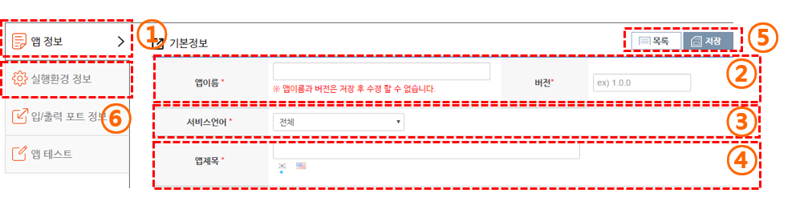
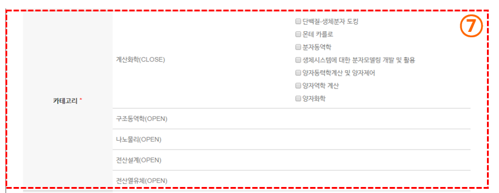
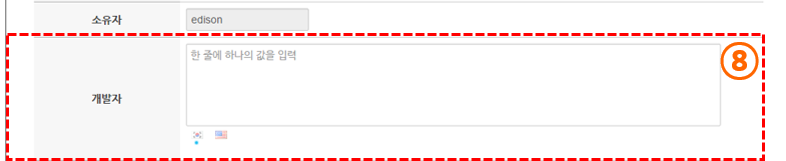
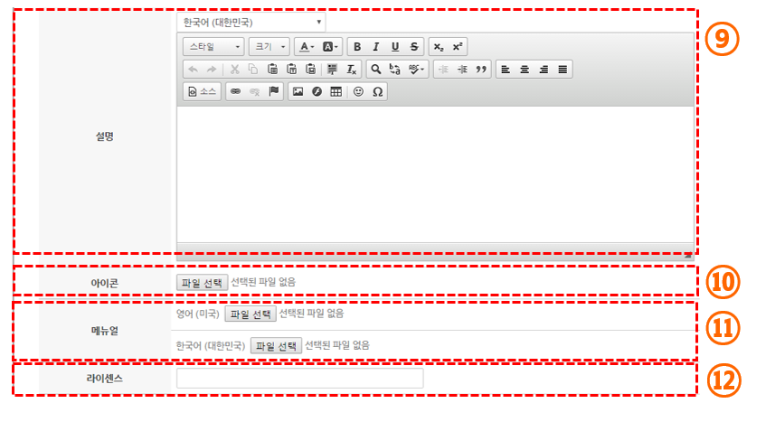

# 사이언스 앱 정보 입력

####기본정보 

(1) 현재 페이지 상태를 탭으로 나타냅니다. 탭 메뉴를 선택하여 다음 단계로 이동 할 수 있습니다.
  - 필수 항목들을 입력 해야지 실행환경 정보 입력 텝으로 이동 할 수 있습니다.
   
(2) 앱 이름과 버전을 입력합니다.
 - 앱 이름 항목은 공백 없이 영문, 숫자, 특수기호( -, . , _ ) 문자만 허용됩니다.
 - 앱 이름, 버전 항목은 저장 후 수정할 수 없습니다.

(3) 서비스 언어를 선택합니다. 서비스 언어를 선택하면 해당 언어에서만 앱이 노출 됩니다.

(4) 앱 제목을 입력합니다. 선택한 서비스 언어의 데이터를 입력해주어야 합니다.

(5) 목록 버튼을 선택하면 SW 목록 화면으로 이동합니다. 저장 버튼을 선택하면 현재 입력된 정보를 저장합니다.

(6) 저장 완료 후 다음 단계인 ‘실행환경 정보’ (탭 메뉴 실행환경 정보) 로 이동 할 수 있습니다.

####카테고리 정보

(7) 선택된 카테고리에 따라 분야에 상관 없이 앱을 조회 할 수 있습니다.
 - `*` 표시 항목은 반드시 입력해야 하는 필수 입력 값 입니다.
 - 앱 정보를 저장한 후 다음 단계로 이동 할 수 있습니다.

#### 개발자 정보

(8) 개발자의 이름을 입력합니다. 한 줄에 하나의 개발자 명을 입력 할 수 있습니다.

소유자의 경우 앱 등록 이후 소유자 변경을 할 수 있습니다.

#### 설명 정보

(9) 설명을 입력합니다. 앱 조회 시 상세정보에 출력 되는 정보입니다. 에디터 상단에 있는 언어 선택 버튼을 이용하여 언어 별 설명 정보를 입력 할 수 있습니다.

(10) 아이콘 이미지를 등록합니다.

(11) 매뉴얼 파일을 등록합니다. 매뉴얼은 언어별로 등록 할 수 있습니다.

(12) 라이센스 정보를 입력합니다. (ex : GPL)

필수 항목이 등록 완료된 이후 저장 버튼을 누르면 다음 단계인 실행 환경 정보를 입력할 수 있습니다.

