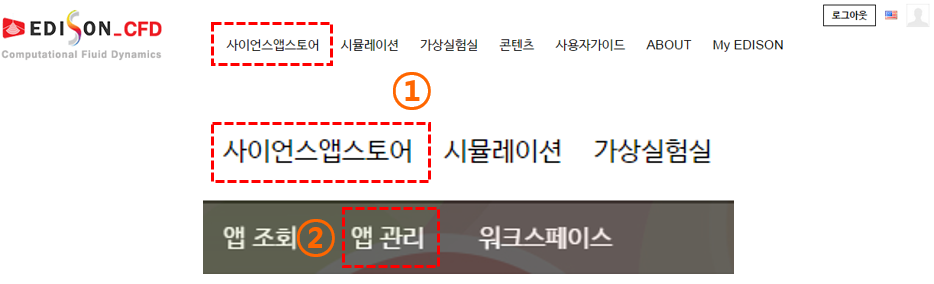
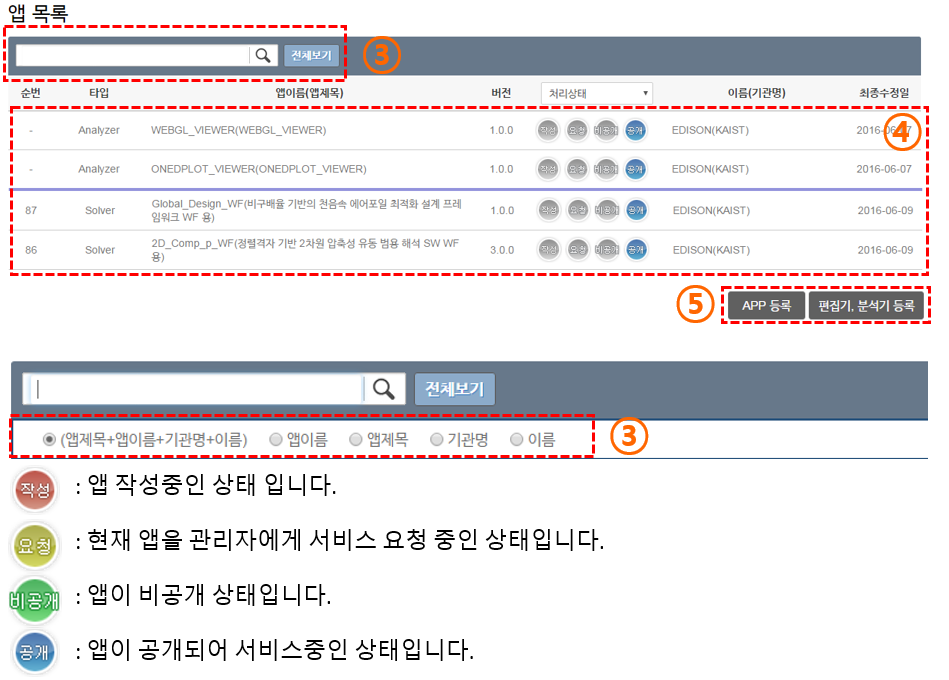

#Science App 관리

### Science App 관리 메뉴 들어가기

(1) 분야 별 사이트의 사이언스 앱스토어 메뉴를 선택합니다.

(2) 하위 메뉴의 앱 관리 메뉴를 선택하여 앱 관리 페이지로 이동합니다.

### App 관리 메뉴 살펴보기

(3) 검색 시 다양한 필터를 적용하여 앱, 편집기, 분석기를 검색할 수 있습니다.
 - 작성중 : 앱 작성 중인 상태 입니다.
 - 요청 : 현재 앱을 관리자에게 서비스 요청 중인 상태입니다.
 - 비공개 : 앱이 비공개 상태입니다.
 - 공개 : 앱이 공개되어 서비스 중인 상태입니다.

(4) 앱, 편집기, 분석기의 기본 정보 및 상태를 확인 할 수 있습니다. 클릭 시 수정 페이지로 이동 합니다.

(5) 앱, 편집기, 분석기 등록 버튼을 선택하면 등록 페이지로 이동합니다. 현재는 APP 등록만 가능합니다. 추후 편집기 및 분석기 등록도 지원할 예정입니다.

리스트의 앱을 클릭 시 작성된 앱 등록 정보를 확인 할 수 있으며 상태에 따라 편집/수정이 가능합니다. 

### 신규 사이언스 앱 등록 과정

신규 사이언스 앱을 등록시 아래 4단계의 과정을 거처야 합니다.
 - [앱 정보 입력](App_Info.md) : App title, name, version등 앱과 관련된 정보를 입력하는 메뉴
 - 실행 정보 입력 : 실행과 관련된 정보를 입력, 실행 파일을 압축하여 업로드하고, 소스코드를 공개하는 경우에는 소스코드도 업로드가 가능합니다.
 - 입출력 포트 정보 입력 : 실행파일의 입력 파일 정보와 출력 파일에 대한 정보를 설정하는 메뉴
 - 앱 테스트 : 등록된 정보와 업로드된 실행파일을 바탕으로 앱이 정상적으로 동작하는지 테스트 하는 메뉴

