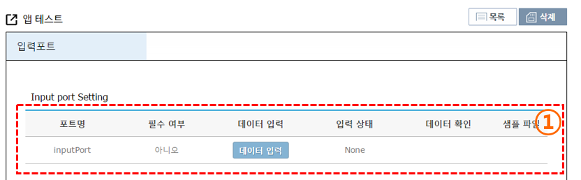
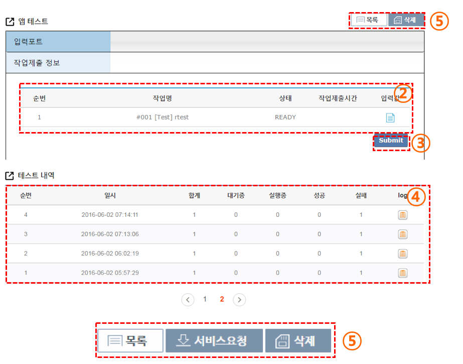

##앱 테스트

포트 정보까지 등록이 완료되었다면, 앱을 테스트 할 수 있습니다.

(1) 사이언스앱 테스트를 위한 input port 의 데이터를 입력합니다. 데이터 입력 버튼을 누르면 입력 창이 노출 됩니다.

 - 앞에서 생성한 입력 포트의 데이터 입력이 가능하며, 입력 완료시 데이터 확인에 'SUCCESS'가 표시 됩니다. 셈플 파일을 열어서 해당 데이터의 형태도 확인할 수 있습니다.

(2) 실행할 테스트 작업의 기본정보와 상태를 확인 할 수 있습니다.

(3) 테스트를 실행하는 버튼 입니다.

(4) 테스트 실행 정보를 확인 할 수 있습니다. 테스트를 진행 하면 실행 정보가 추가 됩니다.

 - 로그 정보를 이용해 정상적으로 실행파일이 동작하는지 확인할 수 있습니다.

(5) 테스트 실행 후 최종 데이터가 성공일 경우 서비스 요청을 하는 버튼이 생성 됩니다.
