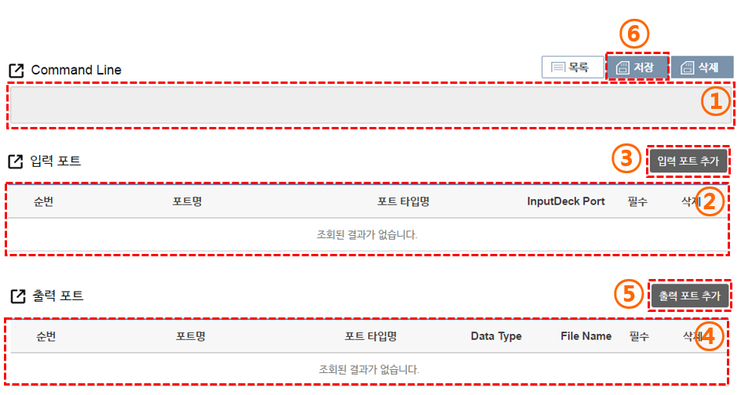

# 입/출력 포트 정보 입력

등록하는 사이언스 앱의 입출력 파일에 대한 정보를 입력하는 부분이다.  

(1) 입력 포트 값에 따른 간략한 Command Line을 조회 할 수 있습니다.

 - 입력한 입력 포트 정보와 앞에서 입력한 파일 명 정보를 토대로 커멘드 라인을 생성합니다. 실제 앱이 실행되는 경우 해당 커멘드 라인으로 생성되니, 실행 파일이 해당 커멘드 라인으로 실행되는지 확인해야 합니다.

(2) 생성된 입력 포트 정보 리스트를 확인 할 수 있습니다.

 - 순번 : 생성한 입력 포트의 순번을 표시한다.
 - 포트명 : 설정된 포트명을 표시한다. 입력 포트에서 포트명은 실행파일의 인풋 옵션과 동일한 의미이며, 

(3) 입력 포트를 선택하는 팝업 창을 실행 할 수 있습니다.

-  

(4) 출력 포트의 기본정보 및 상태를 확인 할 수 있습니다.

(5) 출력 포트를 선택하는 팝업 창을 실행 할 수 있습니다.

(6) 저장버튼을 선택하여 현재 상태를 저장 한 후 다음단계인 ‘앱 테스트’ (탭 메뉴 앱 테스트)로 이동
합니다.

 - 출력 포트 이름이 temp 이면 모니터링에서 중간확인을 할 수 있습니다.
 - 입/출력 포트 정보를 저장한 후 다음 단계로 이동 할 수 있습니다.