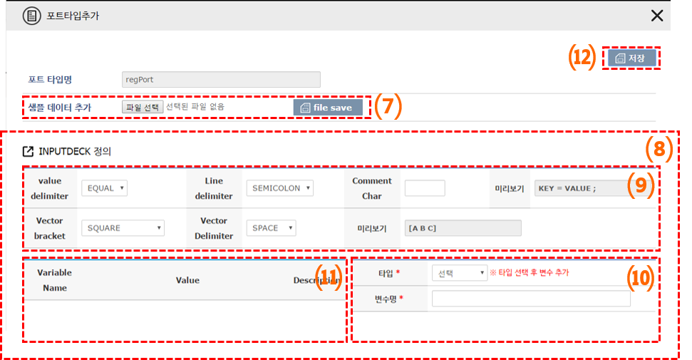

##  INPUTDECK 입력

에디터에 인풋덱을 설정한 경우 아래와 같은 인풋덱 설정 화면이 나온다. 



(7) 샘플 데이터를 추가 할 수 있습니다. 하지만 INPUTDECK 에디터의 경우 이 기능을 사용하지 않습니다.

(8) 추가하는 포트타입이 INPUTDECK Editor 일 때 출력 되는 양식 입니다. 

 INPUTDECK 정의는 INPUTDECK으로 생성되는 입력 파일의 규칙을 정의 합니다.
 

(9) INPUTDECK의 형식을 설정 할 수 있습니다. 

(10) INPUTDECK의 변수를 추가 할 수 있습니다.

(11) 추가된 INPUTDECK의 변수를 확인 할 수 있습니다.

(12) 저장 버튼을 통하여 포트타입을 추가 할 수 있습니다.

 -  ```*``` 표시 항목은 반드시 입력해야 하는 필수 입력 값 입니다.
